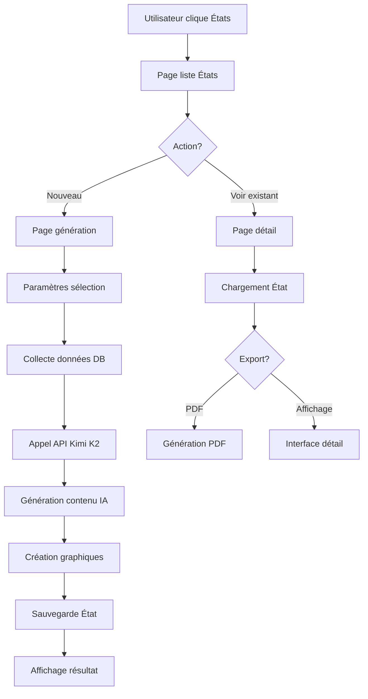

# 🤖 Proposition - Module États Générés par IA

> **📅 Date de proposition :** 01 Août 2025  
> **🎯 Objectif :** Intégration IA Kimi K2 pour génération d'états intelligents  
> **📋 Statut :** 📋 **PROPOSITION - EN ATTENTE DE VALIDATION**

## 🎯 **Analyse des Besoins**

### 📋 **Cahier des Charges**

| Requirement | Description | Priorité |
|-------------|-------------|----------|
| **Page États** | Nouvelle page dans menu après "Client" | 🔴 Critique |
| **Génération IA** | États et graphiques via Kimi K2 | 🔴 Critique |
| **Interface élégante** | Design intuitif et moderne | 🟡 Important |
| **Export PDF** | Impression et export des rapports | 🟡 Important |
| **API Configuration** | Kimi K2 + clé API fournie | 🔴 Critique |

### 🔍 **Analyse de l'Architecture Existante**

**Menu Navigation Actuel :**
```
Dashboard → Incidencias → Client → [NOUVEAU: États] → Editar → Aide
```

**Structure des Routes Existantes :**
- Pattern: `/module` + `/module/action`
- CRUD complet pour chaque entité
- Export PDF déjà implémenté pour clients

## 🏗️ **Architecture Proposée**

### 📁 **Structure de Fichiers**

```
presentation/
├── templates/
│   ├── etats.html                    # Page principale États
│   ├── etat_detail.html             # Détail d'un état spécifique
│   └── etat_generation.html         # Interface génération en temps réel
├── static/
│   ├── css/
│   │   └── etats.css               # Styles spécifiques États
│   └── js/
│       ├── etats.js                # Logique frontend États
│       └── kimi-integration.js     # Intégration API Kimi
core/
├── services/
│   ├── kimi_service.py             # Service API Kimi K2
│   └── etat_generator.py           # Générateur d'états intelligents
├── routes/
│   └── etats_routes.py             # Routes dédiées États
└── models/
    └── etat.py                     # Modèle État (historique, cache)
```

### 🗄️ **Modèle de Données**

```sql
-- Nouvelle table pour stocker les états générés
CREATE TABLE etat (
    id INT PRIMARY KEY AUTO_INCREMENT,
    titre VARCHAR(255) NOT NULL,
    type_etat VARCHAR(50) NOT NULL,        -- 'summary', 'analysis', 'trend', 'custom'
    periode_debut DATE,
    periode_fin DATE,
    contenu_ia TEXT,                       -- Texte généré par IA (JSON)
    graphiques_data JSON,                  -- Données pour graphiques
    parametres JSON,                       -- Paramètres de génération
    statut VARCHAR(20) DEFAULT 'generated', -- 'generating', 'generated', 'error'
    date_creation TIMESTAMP DEFAULT CURRENT_TIMESTAMP,
    date_modification TIMESTAMP DEFAULT CURRENT_TIMESTAMP ON UPDATE CURRENT_TIMESTAMP,
    utilisateur VARCHAR(100),
    hash_cache VARCHAR(64)                 -- Pour cache intelligent
);
```

### 🔌 **Intégration API Kimi K2**

#### Configuration API
```python
# core/config.py
class Config:
    # Configuration IA Kimi
    KIMI_API_KEY = "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"
    KIMI_MODEL = "kimi-k2"
    KIMI_API_URL = "https://api.moonshot.cn/v1/chat/completions"
    KIMI_TIMEOUT = 30
    
    # Configuration États
    ETATS_CACHE_DURATION = 3600  # 1 heure
    ETATS_MAX_HISTORY = 50       # Nombre max d'états stockés
```

#### Service Kimi
```python
# core/services/kimi_service.py
class KimiService:
    def __init__(self):
        self.api_key = current_app.config['KIMI_API_KEY']
        self.model = current_app.config['KIMI_MODEL']
        
    def generate_state_analysis(self, data_context: dict, analysis_type: str) -> dict:
        """
        Génère une analyse intelligente des données
        
        Args:
            data_context: Données contextuelles (incidents, clients, stats)
            analysis_type: Type d'analyse ('summary', 'trend', 'prediction')
            
        Returns:
            dict: Contenu généré par IA (texte + recommandations)
        """
        
    def generate_chart_insights(self, chart_data: dict) -> str:
        """Génère des insights pour les graphiques"""
        
    def create_executive_summary(self, period_data: dict) -> dict:
        """Crée un résumé exécutif intelligent"""
```

### 🎨 **Interface Utilisateur**

#### Page Principale États (`/etats`)
```
┌─────────────────────────────────────────────────────────────┐
│                    📊 États Intelligents                   │
├─────────────────────────────────────────────────────────────┤
│ [Générer un nouvel état ▼]  [Période: Mois en cours ▼]    │
│                                                             │
│ 📈 États Récents:                                          │
│ ┌─────────────────────────────────────────────────────────┐ │
│ │ 🤖 Résumé Exécutif - Juillet 2025                      │ │
│ │    "Amélioration de 15% du taux de résolution..."       │ │
│ │    [Voir] [PDF] [Régénérer]                  01/08/25   │ │
│ └─────────────────────────────────────────────────────────┘ │
│ ┌─────────────────────────────────────────────────────────┐ │
│ │ 📊 Analyse des Tendances - Q2 2025                     │ │
│ │    "Pic d'incidents détecté les mardis..."              │ │
│ │    [Voir] [PDF] [Régénérer]                  28/07/25   │ │
│ └─────────────────────────────────────────────────────────┘ │
└─────────────────────────────────────────────────────────────┘
```

#### Page Génération (`/etats/generer`)
```
┌─────────────────────────────────────────────────────────────┐
│              🤖 Génération d'État Intelligent              │
├─────────────────────────────────────────────────────────────┤
│ Type d'analyse:                                             │
│ ○ Résumé Exécutif    ○ Analyse Tendances   ○ Prédictions   │
│ ○ Rapport Performance ○ Analyse Personnalisée              │
│                                                             │
│ Période d'analyse:                                          │
│ Du: [01/07/2025] Au: [31/07/2025]                          │
│                                                             │
│ Options avancées:                                           │
│ ☑ Inclure graphiques     ☑ Recommandations IA              │
│ ☑ Comparaison période    ☐ Analyse prédictive              │
│                                                             │
│                   [🤖 Générer l'État]                      │
└─────────────────────────────────────────────────────────────┘
```

#### Page Détail État (`/etats/<id>`)
```
┌─────────────────────────────────────────────────────────────┐
│  📊 Résumé Exécutif - Juillet 2025    [🖨️ PDF] [📤 Export] │
├─────────────────────────────────────────────────────────────┤
│                                                             │
│ 🤖 Analyse IA:                                             │
│ "Le mois de juillet a montré une amélioration significative │
│  du taux de résolution avec 15% d'augmentation par rapport  │
│  au mois précédent. Les tendances indiquent..."             │
│                                                             │
│ 📈 Graphiques Interactifs:                                 │
│ [Évolution incidents] [Performance opérateurs] [Satisfaction]│
│                                                             │
│ 💡 Recommandations IA:                                     │
│ • Renforcer l'équipe les mardis (pic d'activité)           │
│ • Optimiser le processus de traitement des incidents "X"    │
│ • Prévoir formation supplémentaire pour Q3                  │
│                                                             │
│ 📊 Métriques Clés:                                         │
│ Incidents traités: 1,247 (+12%)                            │
│ Taux résolution: 94.2% (+15%)                              │
│ Temps moyen: 2.3h (-18%)                                    │
└─────────────────────────────────────────────────────────────┘
```

### 🔄 **Flux de Fonctionnement**



## 🛠️ **Plan d'Implémentation**

### 📊 **Phase 1: Infrastructure (2-3 jours)**

1. **Modèle de données**
   - Création table `etat`
   - Migration base de données
   - Modèle SQLAlchemy

2. **Service API Kimi**
   - Configuration API
   - Service de base
   - Tests de connexion

3. **Routes de base**
   - `/etats` (liste)
   - `/etats/generer` (formulaire)
   - Structure de base

### 📊 **Phase 2: Interface Utilisateur (2-3 jours)**

1. **Templates HTML**
   - Page liste États
   - Formulaire génération
   - Page détail

2. **Intégration menu**
   - Ajout dans navigation
   - Icône et styling

3. **JavaScript frontend**
   - Interactions dynamiques
   - Génération temps réel
   - Graphiques Chart.js

### 📊 **Phase 3: Génération IA (3-4 jours)**

1. **Intégration Kimi K2**
   - Prompts optimisés
   - Gestion erreurs
   - Cache intelligent

2. **Types d'états**
   - Résumé exécutif
   - Analyse tendances
   - Rapports personnalisés

3. **Génération graphiques**
   - Données pour Chart.js
   - Insights IA
   - Recommandations

### 📊 **Phase 4: Export et Finalisation (1-2 jours)**

1. **Export PDF**
   - Template PDF
   - Inclusion graphiques
   - Style professionnel

2. **Tests et optimisation**
   - Tests fonctionnels
   - Performance
   - Documentation

## 🎯 **Types d'États Proposés**

### 📈 **1. Résumé Exécutif**
- Vue d'ensemble période sélectionnée
- KPIs principaux avec évolution
- Insights IA sur performance
- Recommandations stratégiques

### 📊 **2. Analyse des Tendances**
- Patterns temporels (jours, heures)
- Évolution par type d'incident
- Analyse saisonnalité
- Prédictions courtes

### 🎯 **3. Performance Opérateurs**
- Analyse individuelle et équipe
- Charge de travail optimale
- Identification talents/besoins formation
- Recommandations allocation

### 🔍 **4. Analyse Clients**
- Segmentation automatique
- Satisfaction par segment
- Clients à risque
- Opportunités amélioration

### 🤖 **5. États Personnalisés**
- Prompt libre utilisateur
- Analyse sur mesure
- Graphiques adaptés
- Recommandations spécifiques

## 💡 **Prompts IA Optimisés**

### Exemple Prompt Résumé Exécutif
```
Tu es un expert en analyse de données de service client. 
Analyse les données suivantes et fournis un résumé exécutif professionnel :

DONNÉES PÉRIODE: {periode}
- Total incidents: {total_incidents}
- Taux résolution: {taux_resolution}%
- Temps moyen traitement: {temps_moyen}h
- Incidents par type: {incidents_par_type}
- Performance opérateurs: {performance_operateurs}

FORMAT RÉPONSE:
1. 📊 RÉSUMÉ EXÉCUTIF (3-4 phrases)
2. 📈 POINTS POSITIFS (2-3 items)
3. ⚠️ POINTS D'ATTENTION (2-3 items)  
4. 💡 RECOMMANDATIONS (3-4 actions concrètes)
5. 🎯 OBJECTIFS PÉRIODE SUIVANTE (2-3 KPIs)

Style: Professionnel, concis, actionnable.
```

## 🚨 **Risques et Mitigations**

| Risque | Impact | Probabilité | Mitigation |
|--------|--------|-------------|------------|
| **API Kimi indisponible** | 🔴 Élevé | 🟡 Moyen | Cache + fallback texte statique |
| **Coût API élevé** | 🟡 Moyen | 🟡 Moyen | Cache intelligent + limites |
| **Qualité réponses IA** | 🟡 Moyen | 🟡 Moyen | Prompts optimisés + validation |
| **Performance lente** | 🟡 Moyen | 🟡 Moyen | Génération asynchrone + cache |

## 📊 **Métriques de Succès**

### 🎯 **KPIs Techniques**
- Temps génération état: < 30 secondes
- Taux disponibilité: > 95%
- Satisfaction utilisateur: > 4/5

### 🎯 **KPIs Métier**
- Utilisation États: > 70% utilisateurs
- Fréquence génération: > 2/semaine
- Export PDF: > 50% des états

## 💰 **Estimation Coûts**

### 🔧 **Développement**
- **Temps estimé:** 8-12 jours
- **Complexité:** Moyenne-Élevée
- **Ressources:** 1 développeur full-stack

### 💸 **Coûts API**
- **Estimation:** ~$0.01 par état généré
- **Volume attendu:** 100 états/mois = $1/mois
- **Budget recommandé:** $10/mois (sécurité)

## ✅ **Décision Requise**

### 🎯 **Points de Validation**

1. **Architecture proposée** ✅/❌
2. **Interface utilisateur** ✅/❌
3. **Types d'états** ✅/❌
4. **Planning proposé** ✅/❌
5. **Budget API** ✅/❌

### 🚀 **Prochaines Étapes**

1. **Validation proposition** par utilisateur
2. **Ajustements** selon feedback
3. **Démarrage Phase 1** (infrastructure)
4. **Tests API Kimi** en parallèle

---

> **📋 Proposition réalisée par :** Assistant IA FCC_001  
> **📅 Date :** 01 Août 2025  
> **🎯 Statut :** 📋 **EN ATTENTE DE VALIDATION**  
> **🔄 Prochaine action :** Retour utilisateur et validation pour démarrage