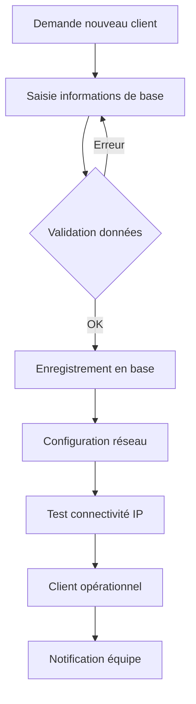
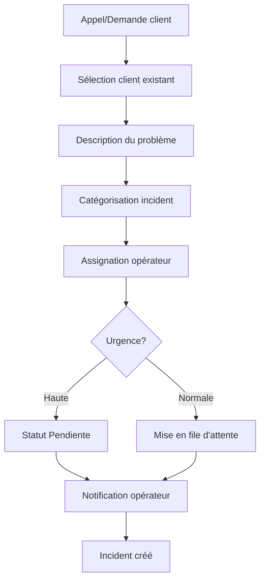

# 🔄 Workflows et Processus Métier - FCC_001

## 🎯 Vue d'Ensemble des Processus

L'application FCC_001 supporte plusieurs **workflows métier** pour la gestion complète du cycle de vie des incidents techniques :

```
┌─────────────────────────────────────────────────────────────┐
│                    WORKFLOWS PRINCIPAUX                    │
├─────────────────┬─────────────────┬─────────────────────────┤
│  GESTION CLIENT │ GESTION INCIDENT│    SUIVI & RAPPORT      │
├─────────────────┼─────────────────┼─────────────────────────┤
│ • Onboarding    │ • Création      │ • Tableau de bord       │
│ • Mise à jour   │ • Assignation   │ • Métriques             │
│ • Maintenance   │ • Résolution    │ • Rapports PDF          │
│ • Historique    │ • Clôture       │ • Analytics             │
└─────────────────┴─────────────────┴─────────────────────────┘
```

## 👥 Workflow Gestion des Clients

### 📋 Processus d'Onboarding Client

#### 1. Création Nouveau Client


#### Étapes Détaillées
1. **Saisie Informations** :
   - Nom complet du client
   - Contact téléphonique
   - Adresse physique complète
   - Localisation (ville/quartier)

2. **Configuration Technique** :
   - Attribution IP Router (192.168.x.1)
   - Attribution IP Antena (192.168.x.2)
   - Validation format IPv4
   - Test de connectivité

3. **Validation et Enregistrement** :
   ```python
   # Workflow de validation
   def validate_new_client(data):
       errors = []
       
       # Validation obligatoire
       if not data.get('nom'):
           errors.append('Nom requis')
       
       # Validation IP
       if data.get('ip_router'):
           if not validate_ip_format(data['ip_router']):
               errors.append('Format IP Router invalide')
       
       # Unicité téléphone
       if Client.query.filter_by(telephone=data['telephone']).first():
           errors.append('Téléphone déjà existant')
       
       return errors
   ```

### 🔄 Processus de Mise à Jour Client

#### Workflow de Modification
```python
# Workflow avec conservation du contexte
@app.route('/clients/<int:id>/modifier', methods=['GET', 'POST'])
def modifier_client(id):
    client = Client.query.get_or_404(id)
    next_url = request.args.get('next', url_for('clients'))
    
    if request.method == 'POST':
        # 1. Validation des modifications
        if validate_client_update(request.form):
            # 2. Sauvegarde historique (futur)
            save_client_history(client)
            
            # 3. Application des changements
            update_client_data(client, request.form)
            
            # 4. Log de l'action
            log_user_action('client_update', client.id)
            
            # 5. Retour à la page précédente
            return redirect(next_url)
    
    return render_template('modifier_client.html', client=client, next_url=next_url)
```

#### Cas d'Usage Typiques
- **Changement d'adresse** : Mise à jour localisation
- **Modification contact** : Nouveau numéro téléphone
- **Reconfiguration réseau** : Changement IPs équipements
- **Correction données** : Rectification erreurs saisie

### 📊 Processus de Consultation Client

#### Fiche Client Complète
```python
# Agrégation des données client
def build_client_overview(client_id):
    client = Client.query.get_or_404(client_id)
    incidents = Incident.query.filter_by(id_client=client_id)\
                              .order_by(Incident.date_heure.desc()).all()
    
    # Calcul métriques
    stats = {
        'total_incidents': len(incidents),
        'incidents_resolus': sum(1 for i in incidents if i.status == 'Solucionadas'),
        'incidents_en_attente': sum(1 for i in incidents if i.status == 'Pendiente'),
        'incidents_bitrix': sum(1 for i in incidents if i.status == 'Bitrix'),
        'dernier_incident': incidents[0] if incidents else None,
        'taux_resolution': calculate_resolution_rate(incidents)
    }
    
    return {
        'client': client,
        'incidents': incidents,
        'stats': stats
    }
```

## 🚨 Workflow Gestion des Incidents

### ➕ Processus de Création d'Incident

#### 1. Workflow de Création


#### Données Capturées
```python
# Structure complète d'un incident
incident_data = {
    'id_client': client_selected.id,
    'intitule': 'Problème de connexion internet',
    'observations': '''
        Client signale une coupure depuis 09h00.
        Symptômes: Pas d'accès internet
        Équipements: Router TP-Link + Antena
        Tests effectués: Ping router OK, ping WAN KO
    ''',
    'status': 'Pendiente',
    'id_operateur': operateur_assigne.id,
    'date_heure': datetime.now(),
    'priorite': 'normale',  # Futur
    'type_incident': 'connectivité'  # Futur
}
```

### 🔧 Processus de Traitement d'Incident

#### États et Transitions
```python
# Machine à états pour incidents
STATUT_TRANSITIONS = {
    'Pendiente': ['Solucionadas', 'Bitrix'],
    'Solucionadas': [],  # État final
    'Bitrix': ['Solucionadas']  # Retour possible
}

def can_transition(from_status, to_status):
    """Vérification transition autorisée"""
    return to_status in STATUT_TRANSITIONS.get(from_status, [])

def transition_incident(incident, new_status, operateur_id, observations=None):
    """Transition sécurisée d'état"""
    if not can_transition(incident.status, new_status):
        raise ValueError(f"Transition {incident.status} → {new_status} non autorisée")
    
    # Log de la transition
    log_incident_transition(incident.id, incident.status, new_status, operateur_id)
    
    # Mise à jour
    incident.status = new_status
    if observations:
        incident.observations += f"\n[{datetime.now()}] {observations}"
    
    db.session.commit()
    
    # Notifications (futur)
    notify_incident_change(incident)
```

#### Workflow de Résolution
1. **Diagnostic Initial** :
   - Analyse des symptômes
   - Test de connectivité
   - Vérification configuration

2. **Intervention Technique** :
   - Action corrective
   - Test de résolution
   - Documentation solution

3. **Validation Client** :
   - Confirmation fonctionnement
   - Clôture incident
   - Mise à jour statut

### 📋 Processus de Suivi d'Incident

#### Dashboard Opérateur
```python
# Vue personnalisée par opérateur
def get_operator_dashboard(operateur_id):
    incidents_en_cours = Incident.query.filter_by(
        id_operateur=operateur_id,
        status='Pendiente'
    ).order_by(Incident.date_heure.asc()).all()
    
    incidents_resolus_semaine = Incident.query.filter(
        Incident.id_operateur == operateur_id,
        Incident.status == 'Solucionadas',
        Incident.date_heure >= datetime.now() - timedelta(days=7)
    ).count()
    
    return {
        'incidents_actifs': incidents_en_cours,
        'charge_travail': len(incidents_en_cours),
        'performance_semaine': incidents_resolus_semaine,
        'prochaine_intervention': incidents_en_cours[0] if incidents_en_cours else None
    }
```

## 📊 Workflow Analytics et Reporting

### 📈 Génération Métriques Automatiques

#### Calcul Statistiques Mensuelles
```python
def generate_monthly_stats(year, month):
    """Génération complète des statistiques mensuelles"""
    
    # Période de calcul
    start_date = datetime(year, month, 1)
    if month == 12:
        end_date = datetime(year + 1, 1, 1)
    else:
        end_date = datetime(year, month + 1, 1)
    
    # Requête optimisée
    incidents_month = Incident.query.filter(
        Incident.date_heure >= start_date,
        Incident.date_heure < end_date
    ).all()
    
    # Agrégations
    stats = {
        'total_incidents': len(incidents_month),
        'par_status': {},
        'par_operateur': {},
        'par_jour': {},
        'evolution': [],
        'taux_resolution': 0
    }
    
    # Calcul par statut
    for status in ['Pendiente', 'Solucionadas', 'Bitrix']:
        stats['par_status'][status] = sum(
            1 for incident in incidents_month if incident.status == status
        )
    
    # Calcul par opérateur
    for incident in incidents_month:
        if incident.operateur:
            nom = incident.operateur.nom
            stats['par_operateur'][nom] = stats['par_operateur'].get(nom, 0) + 1
    
    # Évolution journalière
    for day in range(1, 32):
        try:
            day_date = datetime(year, month, day)
            if day_date >= end_date:
                break
            count = sum(
                1 for incident in incidents_month 
                if incident.date_heure.date() == day_date.date()
            )
            stats['par_jour'][day] = count
            stats['evolution'].append({
                'date': day_date.strftime('%d %b'),
                'count': count
            })
        except ValueError:
            break  # Jour n'existe pas dans le mois
    
    # Taux de résolution
    if stats['total_incidents'] > 0:
        stats['taux_resolution'] = round(
            (stats['par_status']['Solucionadas'] / stats['total_incidents']) * 100, 1
        )
    
    return stats
```

### 📄 Workflow Génération PDF

#### Processus Complet
```python
def generate_client_report(client_id):
    """Génération rapport PDF client"""
    
    # 1. Collecte des données
    client = Client.query.get_or_404(client_id)
    incidents = Incident.query.filter_by(id_client=client_id)\
                              .order_by(Incident.date_heure.desc()).all()
    
    # 2. Calcul métriques
    stats = calculate_client_metrics(incidents)
    
    # 3. Préparation template
    template_data = {
        'client': client,
        'incidents': incidents,
        'stats': stats,
        'date_generation': datetime.now(),
        'periode': f"{datetime.now().year}"
    }
    
    # 4. Rendu HTML optimisé PDF
    html_content = render_template('fiche_client_pdf.html', **template_data)
    
    # 5. Génération PDF
    if WEASYPRINT_AVAILABLE:
        pdf_bytes = weasyprint.HTML(
            string=html_content,
            base_url=request.url_root
        ).write_pdf()
        
        # 6. Préparation réponse
        response = make_response(pdf_bytes)
        response.headers['Content-Type'] = 'application/pdf'
        response.headers['Content-Disposition'] = \
            f'inline; filename="client_{client.id}_{datetime.now().strftime("%Y%m%d")}.pdf"'
        
        # 7. Log génération
        log_pdf_generation(client_id, 'success')
        
        return response
    else:
        # Fallback: Page imprimable
        flash('Génération PDF non disponible. Utilisez Ctrl+P pour imprimer.', 'warning')
        return render_template('fiche_client.html', client=client, incidents=incidents)
```

## 🔍 Workflow Recherche et Navigation

### 🎯 Processus de Recherche Avancée

#### Recherche Multi-Critères
```python
def advanced_client_search(search_params):
    """Recherche intelligente multi-critères"""
    
    query = Client.query
    
    # Recherche textuelle globale
    if search_params.get('search'):
        search_term = f"%{search_params['search']}%"
        query = query.filter(
            or_(
                Client.nom.ilike(search_term),
                Client.telephone.ilike(search_term),
                Client.adresse.ilike(search_term),
                Client.ip_router.ilike(search_term),
                Client.ip_antea.ilike(search_term)
            )
        )
    
    # Filtre par ville
    if search_params.get('ville'):
        query = query.filter(Client.ville == search_params['ville'])
    
    # Tri dynamique
    sort_by = search_params.get('sort', 'id')
    sort_order = search_params.get('order', 'asc')
    
    if sort_by == 'incidents':
        # Tri par nombre d'incidents (sous-requête)
        incident_count = db.session.query(
            Incident.id_client,
            func.count(Incident.id).label('count')
        ).group_by(Incident.id_client).subquery()
        
        query = query.outerjoin(incident_count, Client.id == incident_count.c.id_client)
        if sort_order == 'desc':
            query = query.order_by(desc(incident_count.c.count))
        else:
            query = query.order_by(asc(incident_count.c.count))
    else:
        # Tri standard
        column = getattr(Client, sort_by, Client.id)
        if sort_order == 'desc':
            query = query.order_by(desc(column))
        else:
            query = query.order_by(asc(column))
    
    # Pagination avec conservation paramètres
    page = search_params.get('page', 1)
    per_page = search_params.get('per_page', 10)
    
    return query.paginate(
        page=page,
        per_page=per_page,
        error_out=False
    )
```

### 🔄 Workflow Navigation Contextuelle

#### Conservation du Contexte
```python
def build_navigation_context(request):
    """Construction contexte navigation pour retour intelligent"""
    
    current_url = request.url
    referrer = request.referrer
    
    # Paramètres à conserver
    preserve_params = ['search', 'ville', 'page', 'per_page', 'sort', 'order']
    
    context = {
        'current_url': current_url,
        'back_url': referrer or url_for('clients'),
        'params': {
            param: request.args.get(param)
            for param in preserve_params
            if request.args.get(param)
        }
    }
    
    return context

# Utilisation dans les templates
def inject_navigation_context():
    """Injection automatique du contexte dans tous les templates"""
    return dict(
        navigation_context=build_navigation_context(request)
    )
```

## 🔄 Workflows d'Administration

### 🛠️ Processus de Maintenance

#### Nettoyage Automatique
```python
def maintenance_cleanup():
    """Processus de maintenance automatique"""
    
    # 1. Nettoyage logs anciens
    cleanup_old_logs(days=30)
    
    # 2. Sauvegarde base de données
    backup_database()
    
    # 3. Optimisation base
    optimize_database()
    
    # 4. Vérification intégrité
    check_data_integrity()
    
    # 5. Rapport maintenance
    generate_maintenance_report()

def backup_database():
    """Sauvegarde automatique base de données"""
    timestamp = datetime.now().strftime('%Y%m%d_%H%M%S')
    
    if 'sqlite' in app.config['SQLALCHEMY_DATABASE_URI']:
        # Sauvegarde SQLite
        backup_file = f"backups/sqlite_backup_{timestamp}.db"
        shutil.copy2('gestion_client.db', backup_file)
    else:
        # Export MySQL
        backup_file = f"backups/mysql_backup_{timestamp}.sql"
        # mysqldump command...
    
    log_backup_creation(backup_file)
```

### 📊 Processus de Monitoring

#### Surveillance Système
```python
def system_health_check():
    """Vérification état système"""
    
    health = {
        'database': check_database_connection(),
        'disk_space': check_disk_space(),
        'memory_usage': check_memory_usage(),
        'response_time': check_response_time(),
        'error_rate': check_error_rate(),
        'timestamp': datetime.now()
    }
    
    # Alertes si problème
    if any(not status for status in health.values() if isinstance(status, bool)):
        send_admin_alert(health)
    
    return health

def check_database_connection():
    """Test connexion base de données"""
    try:
        db.session.execute(text('SELECT 1'))
        return True
    except Exception as e:
        logger.error(f"Erreur DB: {e}")
        return False
```

## 🚀 Workflows d'Évolution

### 🔄 Processus de Migration

#### Migration de Données
```python
def migrate_data_to_new_version():
    """Migration données vers nouvelle version"""
    
    # 1. Sauvegarde avant migration
    backup_before_migration()
    
    # 2. Application migrations Alembic
    try:
        from flask_migrate import upgrade
        upgrade()
        log_migration_success()
    except Exception as e:
        log_migration_error(e)
        restore_from_backup()
        raise
    
    # 3. Vérification post-migration
    verify_migration_integrity()
    
    # 4. Nettoyage si succès
    cleanup_migration_files()
```

### 📈 Processus d'Amélioration Continue

#### Collecte Métriques Utilisation
```python
def track_feature_usage():
    """Suivi utilisation fonctionnalités"""
    
    metrics = {
        'clients_created_month': count_clients_created_this_month(),
        'incidents_resolved_month': count_incidents_resolved_this_month(),
        'pdf_generated_month': count_pdf_generated_this_month(),
        'searches_performed_month': count_searches_this_month(),
        'most_used_features': get_most_used_features(),
        'user_patterns': analyze_user_patterns()
    }
    
    # Stockage pour analyse
    store_usage_metrics(metrics)
    
    return metrics
```

---

## ✅ Workflows de Validation

### 🔒 Processus de Validation Métier

#### Règles de Gestion
```python
class BusinessRules:
    """Règles métier centralisées"""
    
    @staticmethod
    def validate_client_deletion(client):
        """Validation suppression client"""
        active_incidents = Incident.query.filter_by(
            id_client=client.id,
            status='Pendiente'
        ).count()
        
        if active_incidents > 0:
            raise BusinessError(
                f"Impossible de supprimer: {active_incidents} incident(s) actif(s)"
            )
    
    @staticmethod
    def validate_incident_closure(incident):
        """Validation clôture incident"""
        if not incident.observations:
            raise BusinessError("Observations requises pour clôture")
        
        if len(incident.observations.strip()) < 10:
            raise BusinessError("Observations insuffisamment détaillées")
    
    @staticmethod
    def validate_operator_assignment(operateur, incident):
        """Validation assignation opérateur"""
        active_incidents = Incident.query.filter_by(
            id_operateur=operateur.id,
            status='Pendiente'
        ).count()
        
        if active_incidents >= 10:  # Limite charge travail
            raise BusinessError(f"Opérateur {operateur.nom} surchargé ({active_incidents} incidents)")
```

---

*Ces workflows garantissent une gestion cohérente et efficace de tous les processus métier de l'application FCC_001.*